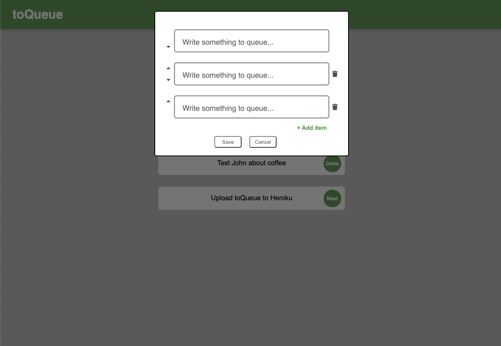

# to-queue-app

## Description

A large task can seem overwhelming when thought of as a whole. With toQueue, users can focus on long-term tasks one step at a time with its simplistic queue-like interface.

This application was built with a MERN stack with data stored in MongoDBAtlas. A live version hosted on Heroku is coming soon.

