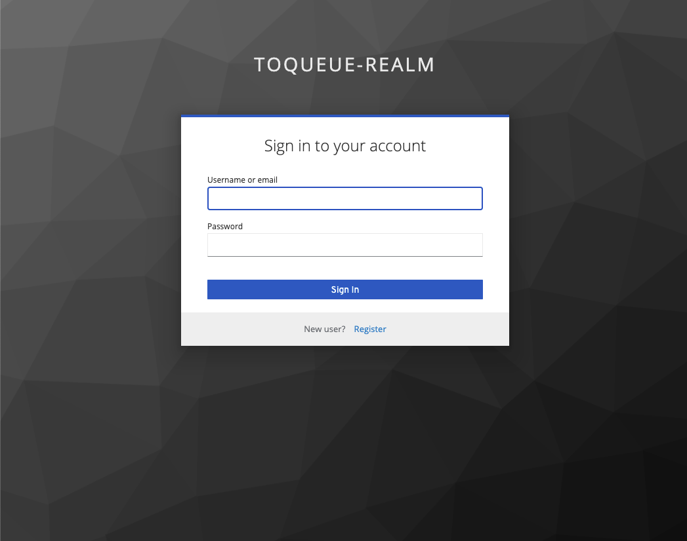
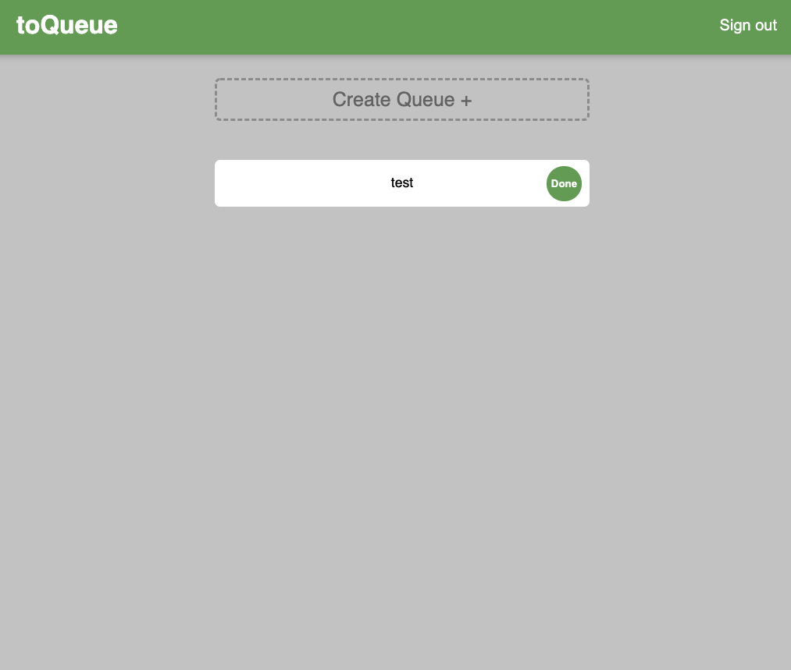

# to-queue-app-keycloak

## Description

This is an extension of the [to-queue-app](https://github.com/kevjin02/to-queue-app), with a focus on user authentication and deployment. 

In this application, Keycloak is integrated for user authentication, and the front-end,
back-end, and Keycloak service are placed in Docker containers. These containers are managed by two load balancers through Kubernetes, and deployed to Linode. A live version of the application can be found [here](http://45.79.60.169:3000).

## Images:

  
  

